# Nmap scan on IP:
Nmap scan report for 10.48.168.70
Host is up (0.084s latency).
Not shown: 997 closed tcp ports (reset)
PORT   STATE SERVICE VERSION
21/tcp open  ftp     vsftpd 3.0.3
22/tcp open  ssh     OpenSSH 7.6p1 Ubuntu 4ubuntu0.3 (Ubuntu Linux; protocol 2.0)
| ssh-hostkey: 
|   2048 c9:03:aa:aa:ea:a9:f1:f4:09:79:c0:47:41:16:f1:9b (RSA)
|   256 2e:1d:83:11:65:03:b4:78:e9:6d:94:d1:3b:db:f4:d6 (ECDSA)
|_  256 91:3d:e4:4f:ab:aa:e2:9e:44:af:d3:57:86:70:bc:39 (ED25519)
80/tcp open  http    Apache httpd 2.4.29 ((Ubuntu))
|_http-server-header: Apache/2.4.29 (Ubuntu)
|_http-title: Beginning of the end
Service Info: OSs: Unix, Linux; CPE: cpe:/o:linux:linux_kernel

# Open Port: 
             21 FTP
             22 SSH
             80 HTTP

# Recon on port 80 (web)
Image found on website:

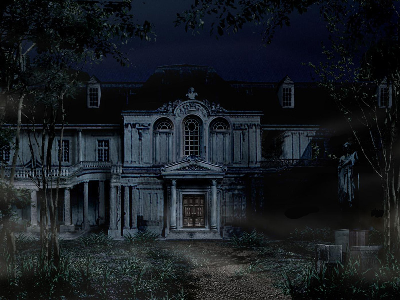

And some details below the image: July 1998, Evening
The STARS alpha team, Chris, Jill, Barry, Weasker and Joseph is in the operation on searching the STARS bravo team in the nortwest of Racoon city.
Unfortunately, the team was attacked by a horde of infected zombie dog. Sadly, Joseph was eaten alive.
The team decided to run for the nearby mansion and the nightmare begin.........

We found the name of the team in this operation: STARS alpha team

NOW, The homepage contained a story introducing the scenario. Clicking on the "Mansion" link redirected us to the following endpoint:
http://10.48.168.70/mansionmain/

This appeared to be the main area of the mansion and served as the next stage of the challenge.

After reaching the /mansionmain/ page, I examined the page source and discovered the following:

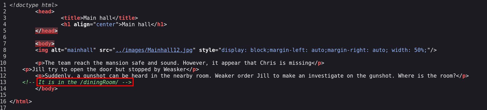

Navigating to the Dining Room (/diningRoom/), I was presented with the following description:

After reaching the room, Jill and Barry started their investigation. Blood stains could be found near the fireplace, raising concerns that they might belong to Chris. During the investigation, Jill was unable to find any empty shell casings, suggesting that another room might contain additional clues. An emblem was mounted on the wall, and the page provided an option to take it.

The page included a "YES" option to collect the emblem, indicating that it could be an important item for progressing further in the challenge.

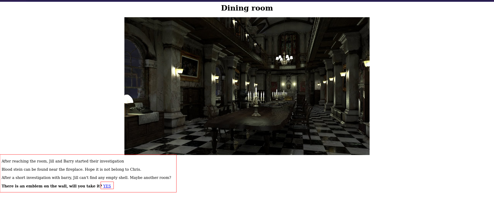

After clicking 'YES' we are redirected to this url: http://10.48.168.70/diningRoom/emblem.php
here we found the emble flag for this room

FLAG: emblem{fec832623ea498e20bf4fe1821d58727}

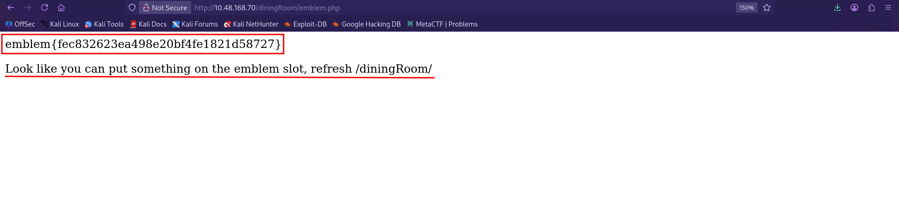

Examining the source code of the /diningRoom/ page revealed a Base64-encoded value. After identifying it as Base64, the next step was to decode it and analyze the resulting output for potential clues.

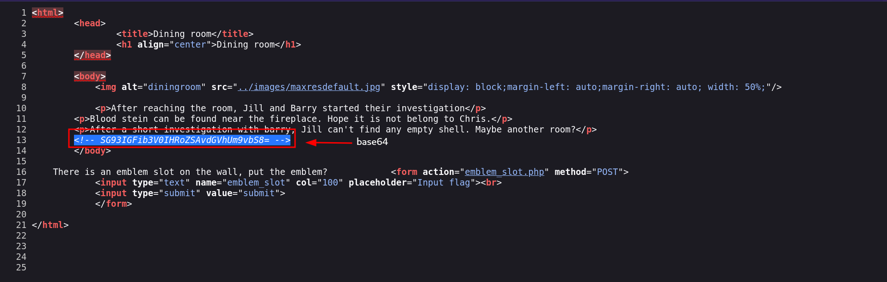

Lets decode this base64:

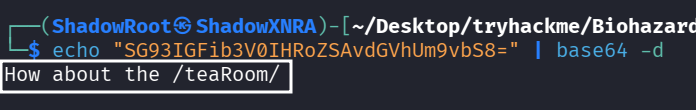

This means our next endpoint is: /teaRoom/ 

When we visit the "/teaRoom/" we will see this description:
What the freak is this! This doesn't look like a human.
The undead walk toward Jill. Without wasting much time, Jill fire at least 6 shots to kill that thing
In addition, there is a body without a head laying down the floor
After the investigation, the body belong to kenneth from Bravo team. What happened here?
After a jiff, Barry broke into the room and found out the truth. In addition, Barry give Jill a Lockpick.
Barry also suggested that Jill should visit the /artRoom/

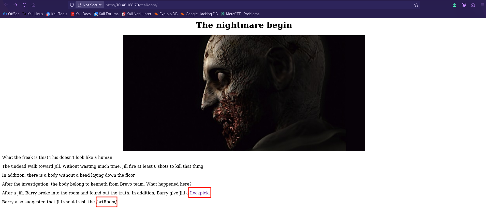

After clicking on the "Lockpick" we redirected to a web on which we found our second flag...

FLAG: lock_pick{037b35e2ff90916a9abf99129c8e1837}

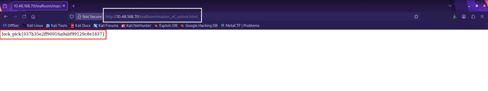

In the previous description we found our next endpoint: /artRoom/

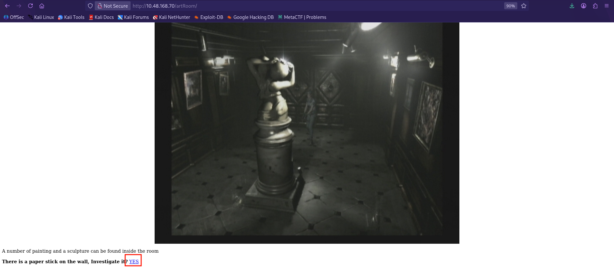

After clicking on the "YES" we are redirected to a url: http://10.48.168.70/artRoom/MansionMap.html
It gives us all the rooms of the mansion

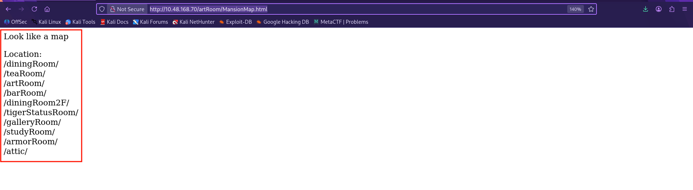

     /diningRoom/
     /teaRoom/
     /artRoom/
     /barRoom/
     /diningRoom2F/
     /tigerStatusRoom/
     /galleryRoom/
     /studyRoom/
     /armorRoom/
     /attic/

We already visited diningRoom, teaRoom, artRoom... now, lets move to the next endpoint: /barRoom/
When we visit the barRoom it asks for the lock_pick to open the door of the bar room

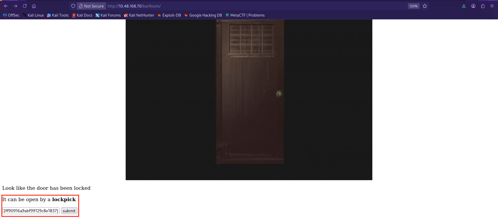

Now, this is the discription given in bar room:
what a messy bar room
A piano can be found in the bar room
Play the piano?
Also, you found a note that written as "moonlight somata", read it? READ

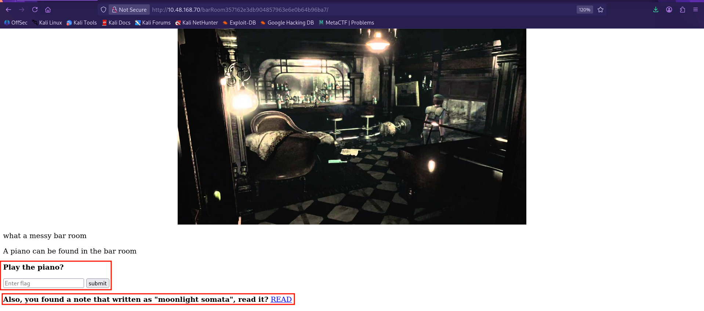

After clicking on "READ" we redirect to an url: http://10.48.168.70/barRoom357162e3db904857963e6e0b64b96ba7/musicNote.html
Here we find a base32 encoded string:

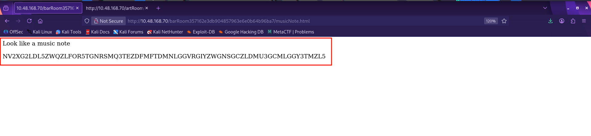

Lets decode this base32:

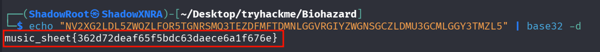

FLAG: music_sheet{362d72deaf65f5bdc63daece6a1f676e}

After entering the music_sheet flag in the input box of barRoom we are redirected to "secret bar room"

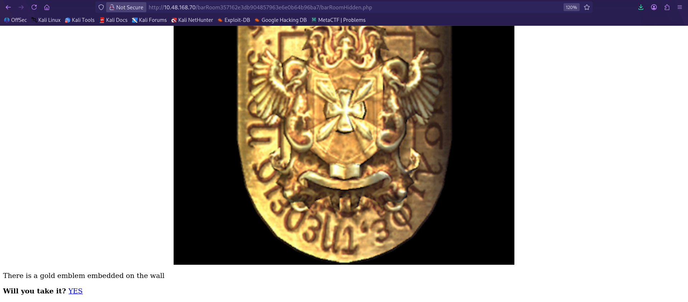

Description of secret bar room: There is a gold emblem embedded on the wall
Will you take it? YES

After clicking on the "YES" we are redirected to a page where we find our next flag

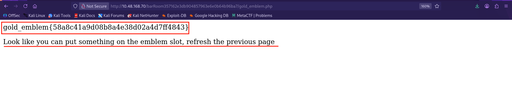

FLAG: gold_emblem{58a8c41a9d08b8a4e38d02a4d7ff4843}

NOW, we are moving to our next endpoint(room): /diningRoom2F/

Description of diningRoom2F: Once Jill reach the room, she saw a tall status with a shiining blue gem on top of it. However, she can't reach it

So, there is nothing on the page so we view the page source

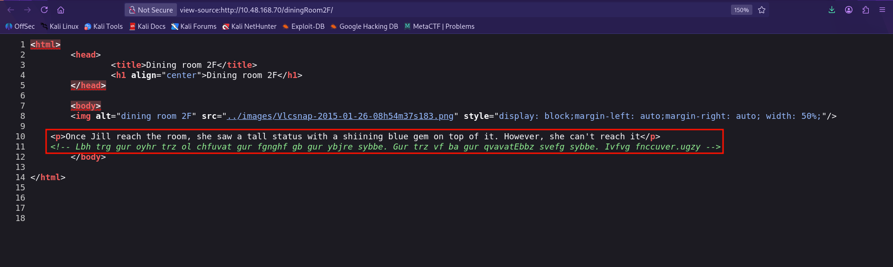

We can see that there is a "ROT 13 CIPHER"..lets decode it

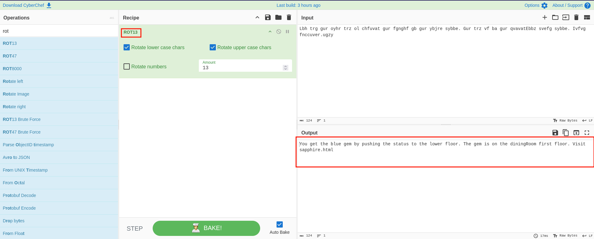

     You get the blue gem by pushing the status to the lower floor. The gem is on the diningRoom first floor. Visit sapphire.html

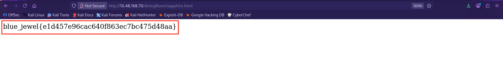

FLAG: blue_jewel{e1d457e96cac640f863ec7bc475d48aa}

Now, we found all the flags except one..so, lets move towards it

when we refresh the secret bar room we will see an input field which is asking for a emblem flag

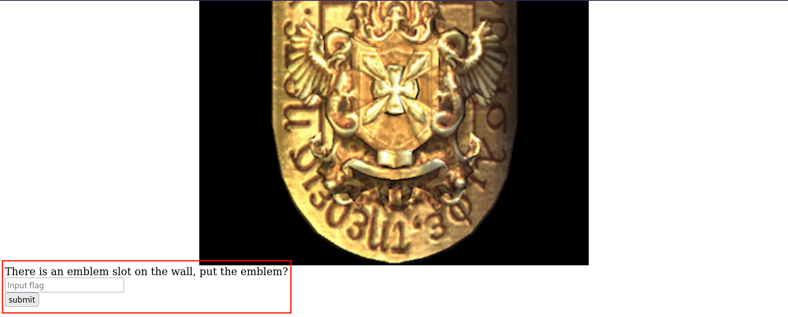

so, put the emblem flag we found earlier in the diningRoom i.e "emblem{fec832623ea498e20bf4fe1821d58727}"
when we put the flag in input box and submit it , we are redirected to a url: http://10.48.168.70/barRoom357162e3db904857963e6e0b64b96ba7/emblem_slot.php here we will se a name: rebecca

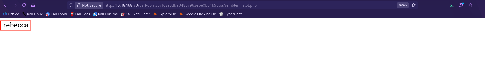

Now, the next step is to put the gold emblem flag i.e"gold_emblem{58a8c41a9d08b8a4e38d02a4d7ff4843}" in the input box of diningRoom

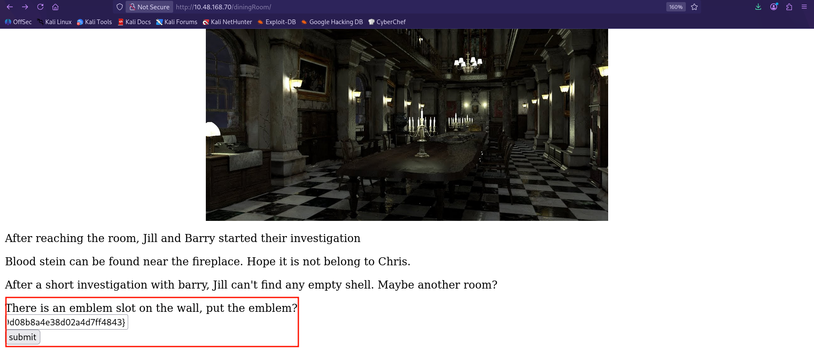

we are redirected to a url: http://10.48.168.70/diningRoom/emblem_slot.php here I found the following encoded string:

      klfvg ks r wimgnd biz mpuiui ulg fiemok tqod. Xii jvmc tbkg ks tempgf tyi_hvgct_jljinf_kvc

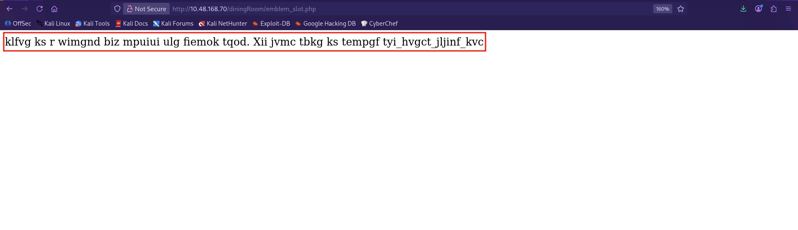

It is a Vigenere Cipher so we need a key to decrypt it...lets use the name we found in barRoom i.e rebecca

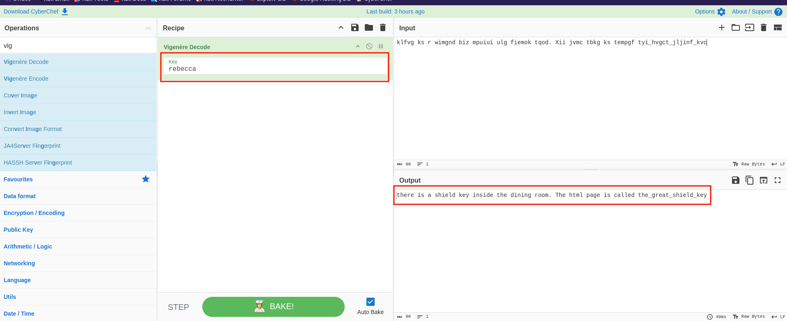

decrypt: there is a shield key inside the dining room. The html page is called the_great_shield_key

Now, lets move to diningRoom...
the url will be: http://10.48.168.70/diningRoom/the_great_shield_key.html

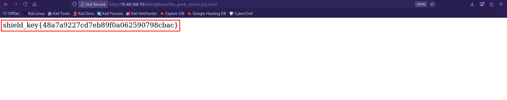

FLAG: shield_key{48a7a9227cd7eb89f0a062590798cbac}

lets move to the next Room i.e /tigerStatusRoom/

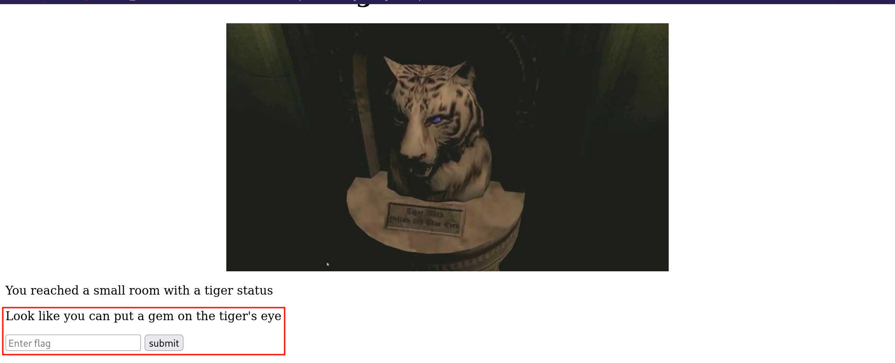

We have to put the gem flag in the input box

when we enter the flag we are redirected to url: http://10.48.168.70//tigerStatusRoom/gem.php

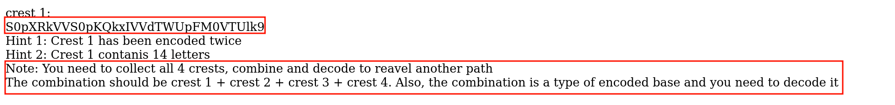

Now, we have to decode the crest 1:

     S0pXRkVVS0pKQkxIVVdTWUpFM0VTUlk9

It is a base64 encoded string so, lets decode it:

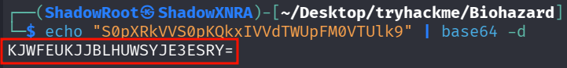

the decoded string is: KJWFEUKJJBLHUWSYJE3ESRY= [base32]

According to the hint we have to decode it again to get the final crest

Lets decode the base32 string:

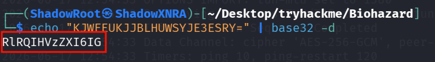

NOW THE FINAL DECODED STRING OF CREST 1: RlRQIHVzZXI6IG

Lets move to the next room which is "/galleryRoom/"

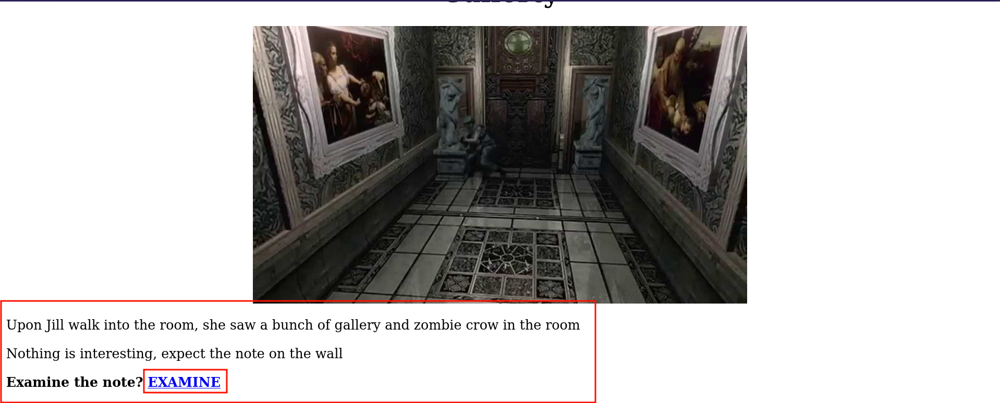

now, click on the "EXAMIN" we are redirected to this url: http://10.48.168.70/galleryRoom/note.txt

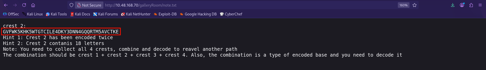

Now, we have to decode the crest 2:

     GVFWK5KHK5WTGTCILE4DKY3DNN4GQQRTM5AVCTKE

it is a base32, so lets decode it:

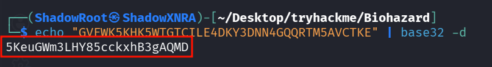

The decoded string is: 5KeuGWm3LHY85cckxhB3gAQMD [base58]

According to the hint we have to decode it again to get the final crest

Lets decode the base58 string:

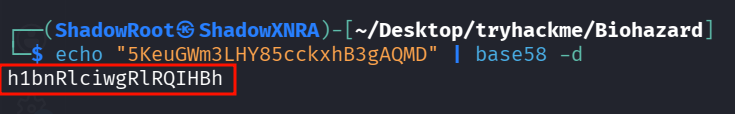

NOW THE FINAL DECODED STRING OF CREST 2: h1bnRlciwgRlRQIHBh

Lets move to the next room which is "/armorRoom/"

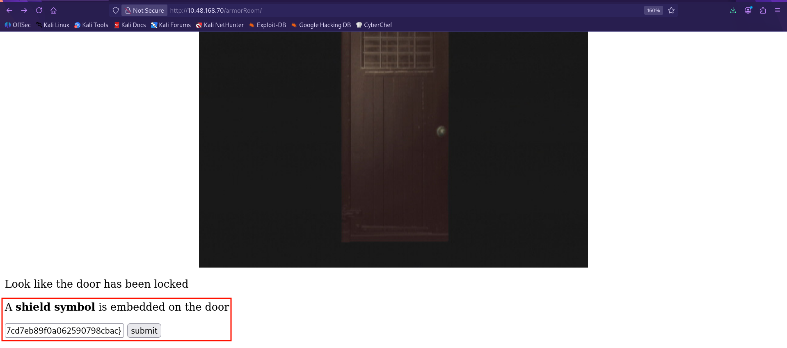

we have to enter the shield flag to acess the armorRoom

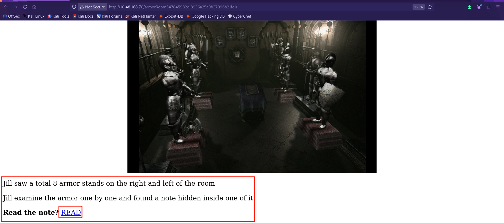

Now we entered the armour room there is a button "READ"..so click on it..

after clicking th button we are redirected to note.txt endpoint

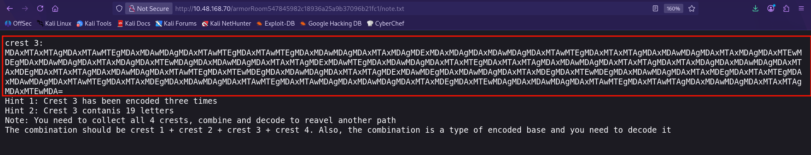

Now, we have to decode the crest 3:

      MDAxMTAxMTAgMDAxMTAwMTEgMDAxMDAwMDAgMDAxMTAwMTEgMDAxMTAwMTEgMDAxMDAwMDAgMDAxMTAxMDAgMDExMDAxMDAgMDAxMDAwMDAgMDAxMTAwMTEgMDAxMTAxMTAgMDAxMDAwMDAgMDAxMTAxMDAgMDAxMTEwMDEgMDAxMDAwMDAgMDAxMTAxMDAgMDAxMTEwMDAgMDAxMDAwMDAgMDAxMTAxMTAgMDExMDAwMTEgMDAxMDAwMDAgMDAxMTAxMTEgMDAxMTAxMTAgMDAxMDAwMDAgMDAxMTAxMTAgMDAxMTAxMDAgMDAxMDAwMDAgMDAxMTAxMDEgMDAxMTAxMTAgMDAxMDAwMDAgMDAxMTAwMTEgMDAxMTEwMDEgMDAxMDAwMDAgMDAxMTAxMTAgMDExMDAwMDEgMDAxMDAwMDAgMDAxMTAxMDEgMDAxMTEwMDEgMDAxMDAwMDAgMDAxMTAxMDEgMDAxMTAxMTEgMDAxMDAwMDAgMDAxMTAwMTEgMDAxMTAxMDEgMDAxMDAwMDAgMDAxMTAwMTEgMDAxMTAwMDAgMDAxMDAwMDAgMDAxMTAxMDEgMDAxMTEwMDAgMDAxMDAwMDAgMDAxMTAwMTEgMDAxMTAwMTAgMDAxMDAwMDAgMDAxMTAxMTAgMDAxMTEwMDA=

it is a base64, so lets decode it:

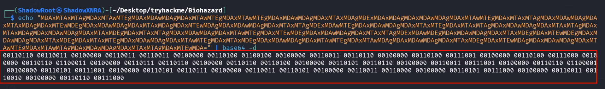

The decoded string is: 00110110 00110011 00100000 00110011 00110011 00100000 00110100 01100100 00100000 00110011 00110110 00100000 00110100 00111001 00100000 00110100 00111000 00100000 00110110 01100011 00100000 00110111 00110110 00100000 00110110 00110100 00100000 00110101 00110110 00100000 00110011 00111001 00100000 00110110 01100001 00100000 00110101 00111001 00100000 00110101 00110111 00100000 00110011 00110101 00100000 00110011 00110000 00100000 00110101 00111000 00100000 00110011 00110010 00100000 00110110 00111000 [Binary]

According to the hint we have to decode it again to get

Lets decode the Binary to get the crest:

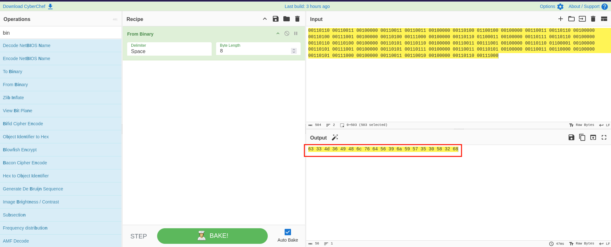

Now, it is Hex encoded..so decode it:

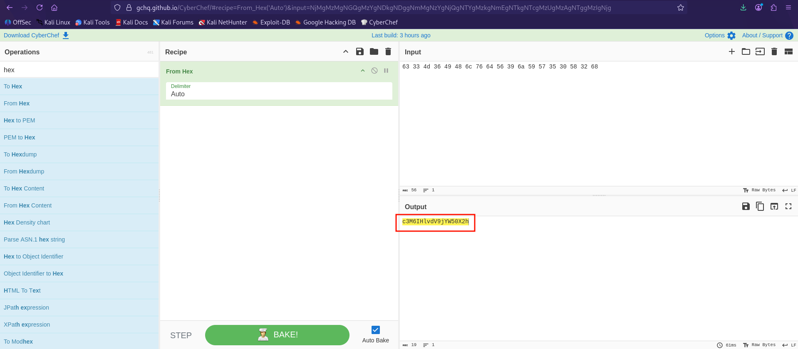

NOW THE FINAL DECODED STRING OF CREST 3: c3M6IHlvdV9jYW50X2h

Lets move to the next room which is "/attic/"

Similar to the armourRoom we have to enter the shield key to unlock this room

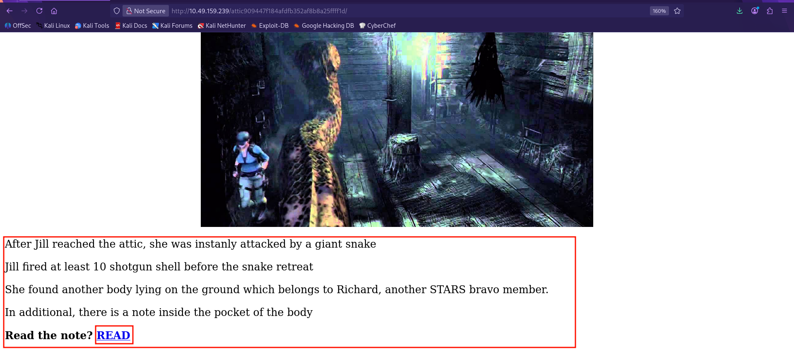

lets click on the "READ" button

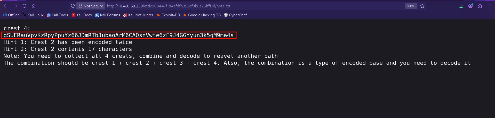

Now, we have to decode the crest 4:

     gSUERauVpvKzRpyPpuYz66JDmRTbJubaoArM6CAQsnVwte6zF9J4GGYyun3k5qM9ma4s

It is a bese58 encoded string so, lets decode it:

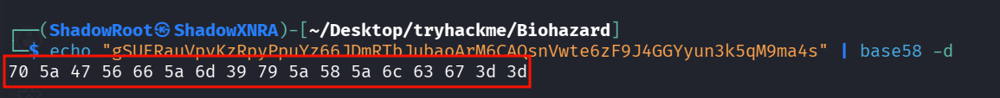

The decoded string is: 70 5a 47 56 66 5a 6d 39 79 5a 58 5a 6c 63 67 3d 3d [hex]

According to the hint we have to decode it again to get the final crest

Lets decode the hex: 

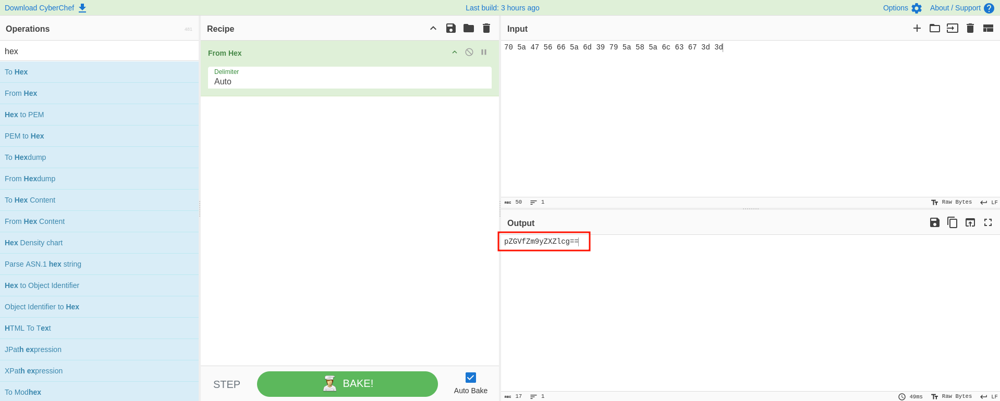

NOW THE FINAL DECODED STRING OF CREST 4: pZGVfZm9yZXZlcg==

According to the hint we have to combine all the decoded crest

    RlRQIHVzZXI6IG + h1bnRlciwgRlRQIHBh + c3M6IHlvdV9jYW50X2h + pZGVfZm9yZXZlcg== :- RlRQIHVzZXI6IGh1bnRlciwgRlRQIHBhc3M6IHlvdV9jYW50X2hpZGVfZm9yZXZlcg==

It is base64 encode so lets decode it to get the final answer:

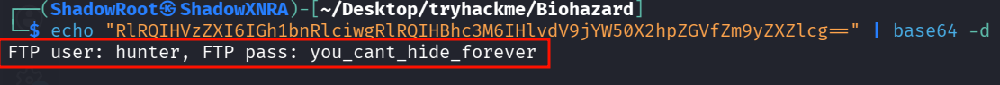

     FTP user: hunter, FTP pass: you_cant_hide_forever

WE HAVE COMPLETED ALL THE MANSION QUESTIONS..SO, LETS MOVE TO THE FTP..

# Recon on port 21 (FTP)

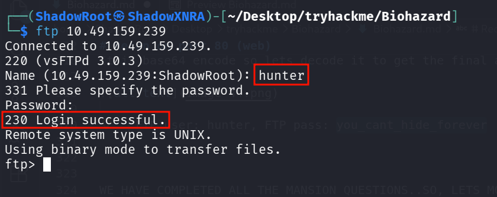

Lets check the available files on the FTP server with ls command

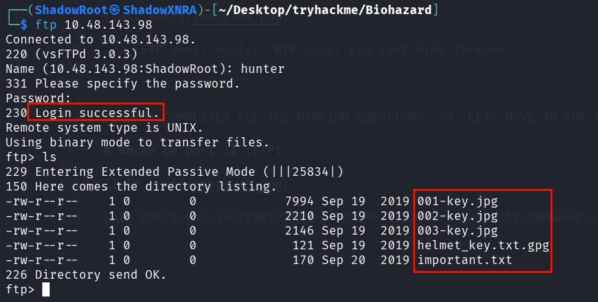

I download all the available photos and files on my desktop and lets examin it one by one

This is written in important.txt file:

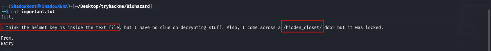

Here we find the answer of the hidden directory: "/hidden_closet/"

Lets examin the first image: 001-key.jpg

I used stegseek to extract the hidden file from the image and then read it with cat command..the exracted string is: cGxhbnQ0Ml9jYW

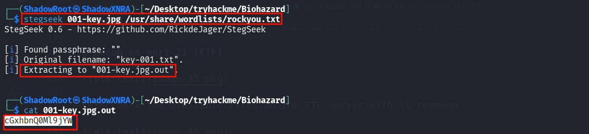

NOW, lets move to the next image: 002-key.jpg

I used exiftool to read the metadata and found a string: 5fYmVfZGVzdHJveV9

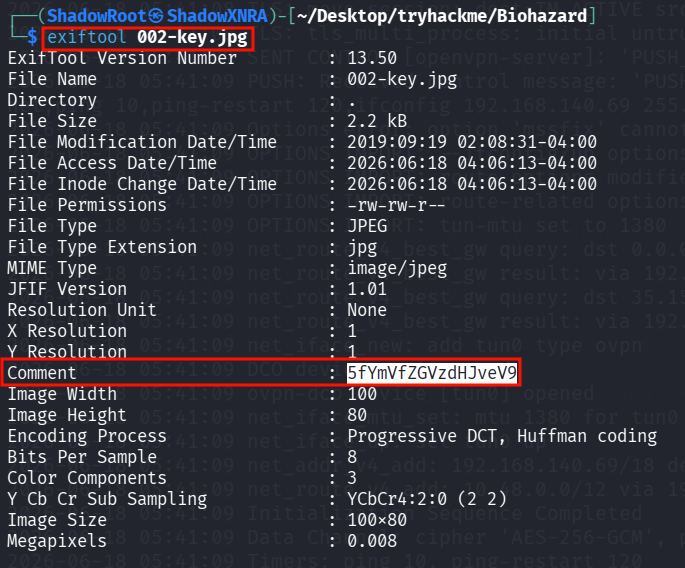

NOW, lets move to the next image: 003-key.jpg

I used binwalk tool to extract the hidden folder in this image and then read the text file in the folder and found this string: 3aXRoX3Zqb2x0

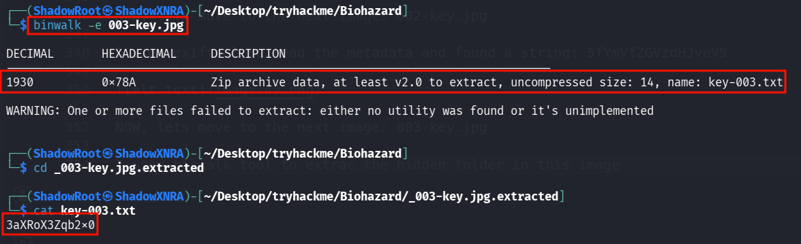

As we extracted all the string now lets add it:

       cGxhbnQ0Ml9jYW + 5fYmVfZGVzdHJveV9 + 3aXRoX3Zqb2x0 :- cGxhbnQ0Ml9jYW5fYmVfZGVzdHJveV93aXRoX3Zqb2x0

It is an base64 encoded string. so, lets decode it:

       plant42_can_be_destroy_with_vjolt

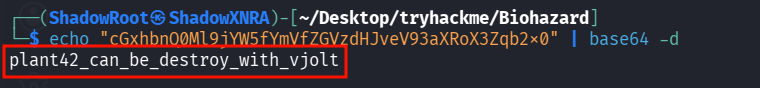

Now, we use this string as password for "helmet_key.txt.gpg"

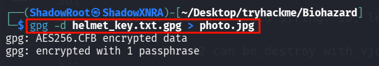

Now when we read the extracted file, we will see the helmet_flag:

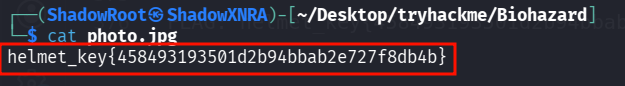

FLAG: helmet_key{458493193501d2b94bbab2e727f8db4b}

NOW LETS MOVE TO THE WEB PAGE BECAUSE WE HAVE HELMET FLAG NOW..

When we visit the "/studyRoom/" room endpoint it asks for the helmet flag

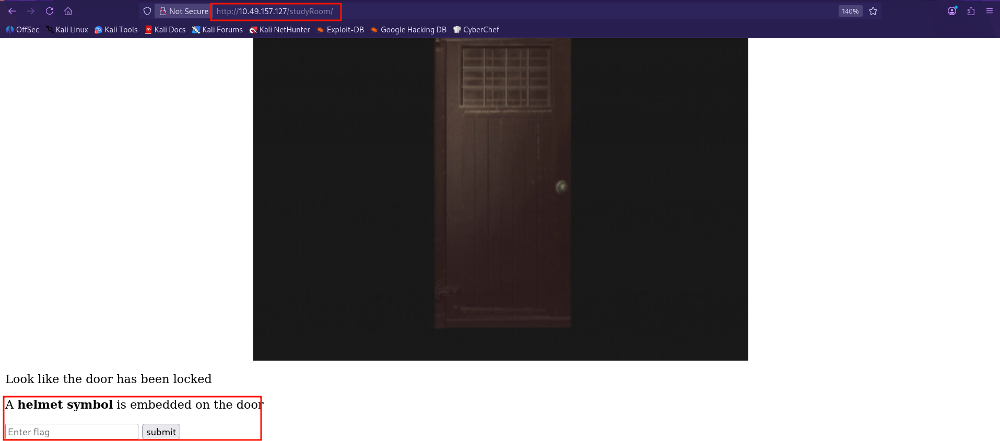

After entering the flag we are redirected to a new page:

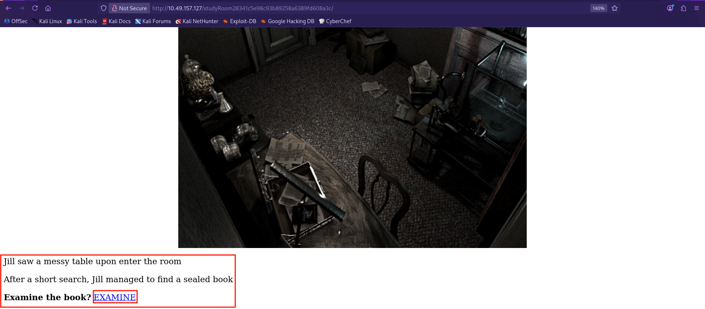

when we click on the "EXAMINE" button "doom.tar.gz" this tar file is downloaded lets examine this tar file

When we open the tar file we will see a SSH username

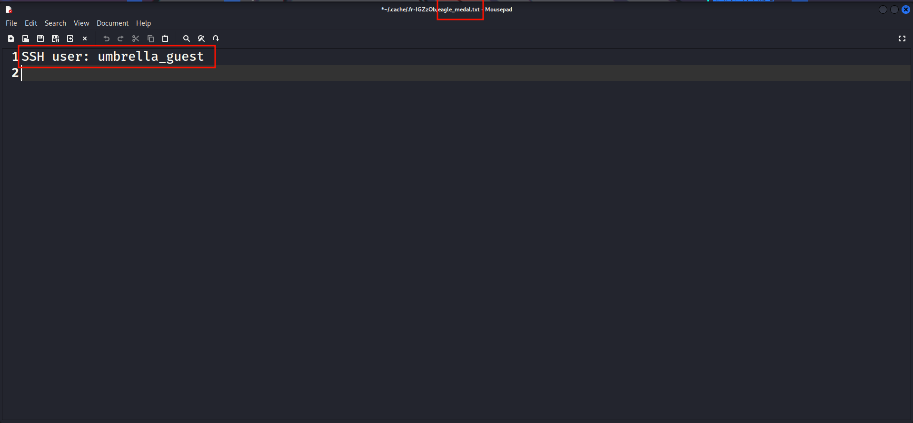

      Username: umbrella_guest

Now, lets visit the endpoint "/hidden_closet/" which was mentioned in the "important.txt" file
When we visit this endpoint and enter the helmet flag we are redirected to a new page:

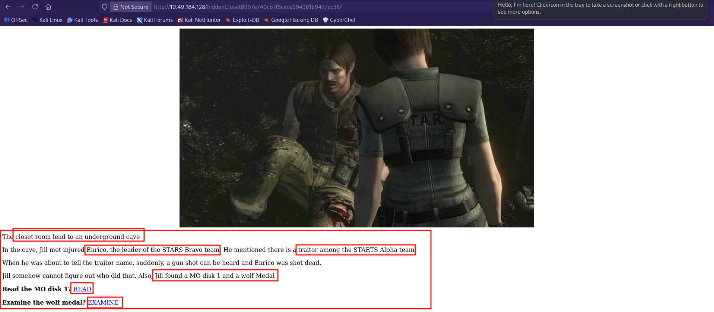

Answer for the leader of STARS bravo is: Enrico

Our next move is to examine the both "MO disk 1" and "wolf medal"

After examining the wolf madal we find the SSH password:

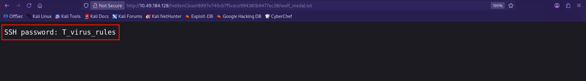

       Password: T_virus_rules

When we examin the MO disk 1 we will find a Vigenère cipher

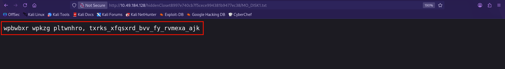

       wpbwbxr wpkzg pltwnhro, txrks_xfqsxrd_bvv_fy_rvmexa_ajk

We are required a key to decrypt it...for now keep it aside and move towards SSH because weh have both username and passowrd

# Recon on port 22 (SSH)

We successfully connected with port 22 (SSH):

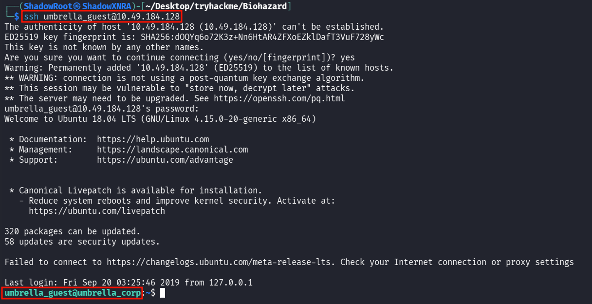

Lets see the available file by using ls -la command:

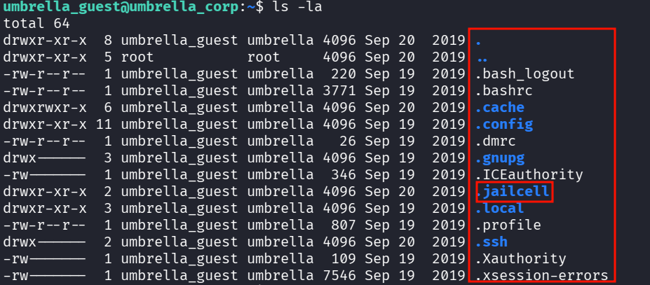

Now, lets move to the ".jailcell" directory and see what we can find there

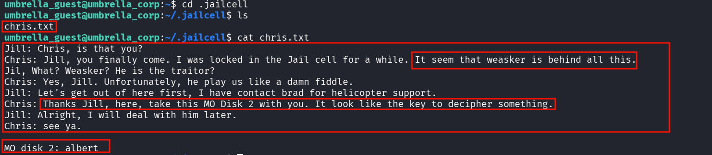

We find the traitor: weasker

Where you find Chris: jailcell

Key: albert

We have the key to decrypt the Vigenère cipher..so, lets decrypt it:

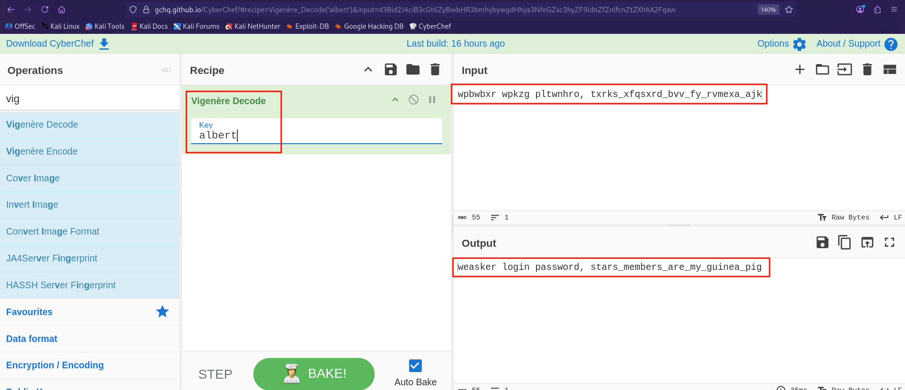

      password of weasker: stars_members_are_my_guinea_pig

We have the weasker username and password..

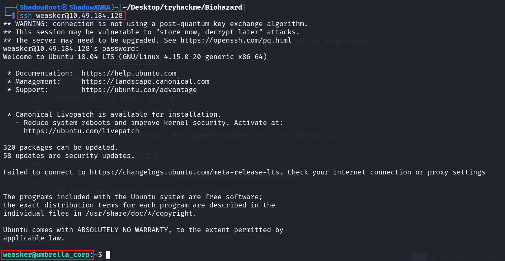

Now, lets check for the available file and directory with ls -la command

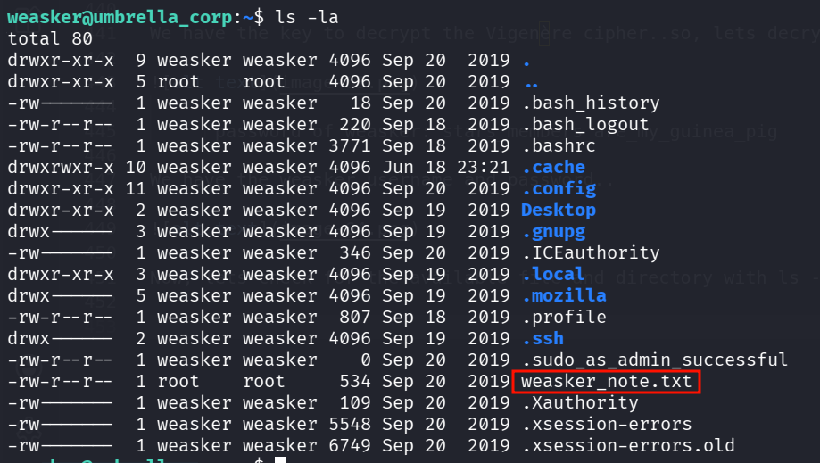

next move is to read the "weasker_note.txt" file:

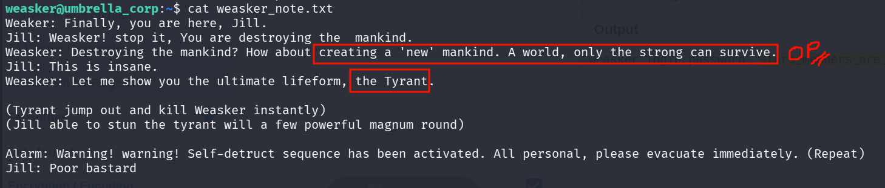

Now, we have answers for this question

The name of the ultimate form: Tyrant

We have to read the root flag..and weasker has the permission to read the root flag so we don't need to prv escalation to read the flag

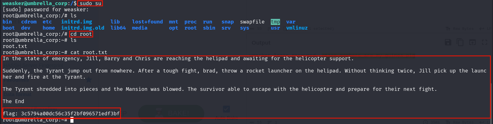

FLAG: 3c5794a00dc56c35f2bf096571edf3bf

Let's speedrun the answers we spent way too long finding

# The Mansion

What is the emblem flag: emblem{fec832623ea498e20bf4fe1821d58727}

What is the lock pick flag: lock_pick{037b35e2ff90916a9abf99129c8e1837}

What is the music sheet flag: music_sheet{362d72deaf65f5bdc63daece6a1f676e}

What is the gold emblem flag: gold_emblem{58a8c41a9d08b8a4e38d02a4d7ff4843}

What is the shield key flag: shield_key{48a7a9227cd7eb89f0a062590798cbac}

What is the blue gem flag: blue_jewel{e1d457e96cac640f863ec7bc475d48aa}

What is the FTP username: hunter

What is the FTP password: you_cant_hide_forever

# The Guard House

Where is the hidden directory mentioned by Barry: /hidden_closet/

Password for the encrypted file: plant42_can_be_destroy_with_vjolt

What is the helmet key flag: helmet_key{458493193501d2b94bbab2e727f8db4b}

# The Revisit

What is the SSH login username: umbrella_guest

What is the SSH login password: T_virus_rules

Who the STARS bravo team leader: Enrico

# Underground Laboratory

Where you found Chris: jailcell

Who is the traitor: weasker

The login password for the traitor: stars_members_are_my_guinea_pig

The name of the ultimate form: Tyrant

The root flag: 3c5794a00dc56c35f2bf096571edf3bf

And that's a wrap! 🎉

Believe it or not, I finished the actual lab in just one day... but writing this writeup took me three days. 😭

Apparently, hacking the box was easier than explaining what I did to hack the box.

If this writeup helped you, taught you something new, or saved you from staring at the screen for hours, consider dropping a like. It costs you nothing, but it makes those extra three days of writing feel worth it. ❤️

Final words:

"Finding the flag is temporary, but the knowledge you gain along the way stays with you forever."

Until the next challenge, keep learning, keep breaking things (legally), and never stop asking "What happens if I try this?